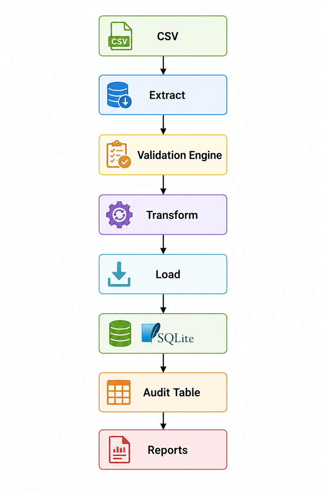

# Python ETL Pipeline

## Features

- CSV Extraction
- Validation Framework
- Failed Record Handling
- Audit Logging
- SQLite Storage
- Report Generation
- GitHub Actions CI

---

## Architecture

---

## Validation Report

---

## Audit Table

---

## Run Locally

pip install -r requirements.txt

python main.py

---

## Run Tests

pytest